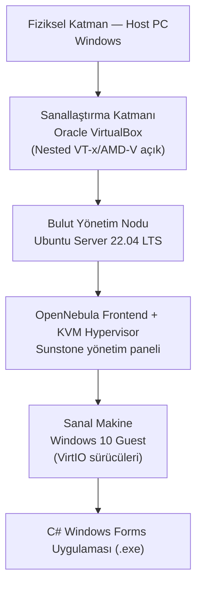

# C# Windows Forms Uygulamasının Özel Bulut Ortamına Migrasyonu

Yerel ortamda geliştirilen bir masaüstü uygulamasının, sanallaştırma teknolojileriyle kurulan bir **OpenNebula özel bulut (private cloud)** altyapısına taşınması çalışması. "Lift and shift" yaklaşımı simüle edilerek uygulamanın bir Windows sanal makinesi üzerinde bulut ortamında çalıştırılması hedeflendi.

Çalışma planlanan şekilde tamamlanamadı; iç içe sanallaştırmada karşılaşılan bir disk sorunu nedeniyle **Render.com üzerinden bir B planı** ile sonuçlandırıldı. Karşılaşılan engeller ve alınan kararlar [Karşılaşılan Sorunlar ve Alınan Kararlar](#karşılaşılan-sorunlar-ve-alınan-kararlar) bölümünde anlatılıyor.

---

## Bu repo ne içeriyor?

Bu repoda **iki ayrı şey** var; karıştırılmaması için baştan ayırmak gerekiyor:

| | İçerik | Nerede |
|---|---|---|
| **1. Migrasyon çalışması** | OpenNebula özel bulut kurulumunun adım adım dokümantasyonu — komutlar, yapılandırma, VM oluşturma süreci | Bu README |
| **2. Buluta aktarılan uygulama** | Render.com'a deploy edilen statik web sitesi (HTML, CSS, JavaScript, Bootstrap) | `index.html`, `survey.html`, `css/`, `js/`, `img/` |

**Repoda bulunmayan:** Migrasyonun ilk hedefi olan C# Windows Forms uygulaması. Render.com masaüstü uygulaması barındırmaya uygun olmadığı için, deploy edilecek uygulama bu repodaki web sitesiyle değiştirildi (bkz. B planı).

🔗 **Yayındaki site:** https://bulutbilisimodev2.onrender.com

> Bu sitenin React + TypeScript ile sıfırdan yeniden yazılmış hali ayrı bir repoda: [desideroo/bb-shop](https://github.com/desideroo/bb-shop)

---

## Mimari

Kurulan yapı, fiziksel makineden uygulamaya kadar iç içe geçmiş katmanlardan oluşuyor:



Kritik nokta **iç içe sanallaştırma**: VirtualBox içindeki Ubuntu'nun, kendi içinde KVM ile başka bir sanal makine çalıştırabilmesi gerekiyordu. Bu da donanım sanallaştırma desteğinin misafir işletim sistemine aktarılmasını zorunlu kıldı.

## Kullanılan teknolojiler

| Katman | Teknoloji |
|---|---|
| Uygulama | C# Windows Forms (.NET Framework) · Statik web sitesi (HTML, CSS, JavaScript, Bootstrap 5.3) |
| Sanallaştırma | Oracle VirtualBox |
| Bulut host işletim sistemi | Ubuntu Server 22.04 LTS |
| Bulut yönetimi | OpenNebula 6.4 (Sunstone) · Render.com |
| Guest işletim sistemi | Windows 10 |
| Sürücüler | VirtIO (Windows üzerinde KVM performansı için) |

---

## Kurulum ve yapılandırma adımları

Proje aşağıdaki adımlar izlenerek gerçekleştirildi.

### 1. Nested virtualization aktivasyonu

OpenNebula'nın (KVM) Ubuntu sanal makinesi içinde başka sanal makineler çalıştırabilmesi için **Nested VT-x/AMD-V** özelliğinin açılması gerekiyor. Bu işlem, Ubuntu sanal makinesi **kapalıyken** Windows host üzerinde yönetici yetkili CMD ile yapıldı.

```cmd
cd "C:\Program Files\Oracle\VirtualBox"
VBoxManage modifyvm "OpenNebula_Sunucusu" --nested-hw-virt on
```

### 2. Ubuntu üzerine OpenNebula kurulumu

```bash
sudo apt-get update && sudo apt-get upgrade -y
sudo apt-get install -y gnupg wget curl
```

Depo anahtarının eklenmesi ve OpenNebula 6.4'ün kurulumu:

```bash
wget -q -O- https://downloads.opennebula.io/repo/repo.key | sudo apt-key add -

echo "deb https://downloads.opennebula.io/repo/6.4/Ubuntu/22.04 stable opennebula" \
  | sudo tee /etc/apt/sources.list.d/opennebula.list

sudo apt-get update
sudo apt-get install -y opennebula opennebula-sunstone opennebula-gate \
  opennebula-flow opennebula-node-kvm
```

> **Not:** Yukarıdaki `apt-key add` komutu bu çalışmada kullanıldığı haliyle bırakıldı, ancak Ubuntu 22.04 ve sonrasında kullanımdan kaldırıldı ve uyarı üretiyor. Güncel yöntem, anahtarı ayrı bir keyring dosyasına yazıp depo satırında `signed-by` ile göstermek:
>
> ```bash
> wget -qO- https://downloads.opennebula.io/repo/repo.key \
>   | sudo gpg --dearmor -o /usr/share/keyrings/opennebula.gpg
>
> echo "deb [signed-by=/usr/share/keyrings/opennebula.gpg] https://downloads.opennebula.io/repo/6.4/Ubuntu/22.04 stable opennebula" \
>   | sudo tee /etc/apt/sources.list.d/opennebula.list
> ```

Servislerin başlatılması:

```bash
sudo systemctl enable --now opennebula opennebula-sunstone
```

### 3. SSH ve erişim ayarları

OpenNebula yönetimi ve dosya transferi için SSH açıldı.

```bash
sudo systemctl enable --now ssh
sudo ufw allow ssh
```

### 4. ISO dosyalarının taşınması ve yetkilendirme

Windows 10 kurulumu için gereken `.iso` dosyaları ve VirtIO sürücüleri `/var/lib/one/` altına taşındı.

```bash
sudo mv ~/Downloads/win10.iso /var/lib/one/
sudo mv ~/Downloads/virtio-win.iso /var/lib/one/
sudo mv ~/Downloads/one-context.iso /var/lib/one/
```

**Kritik adım —** OpenNebula dosyaları yalnızca `oneadmin` kullanıcısı üzerinden görebiliyor; sahiplik ve izinler ayarlanmadan imajlar panelde görünmüyor:

```bash
sudo chown -R oneadmin:oneadmin /var/lib/one/
sudo chmod -R 775 /var/lib/one/
```

### 5. Sunstone arayüzüne giriş

`oneadmin` kullanıcısının otomatik oluşturulan şifresi okunarak tarayıcıdan giriş yapıldı.

```bash
sudo cat /var/lib/one/.one/one_auth
```

- **URL:** `https://<UBUNTU_IP_ADRESI>:9869`
- **Kullanıcı:** `oneadmin`
- **Şifre:** yukarıdaki komutun çıktısı

### 6. Sanal makine oluşturma

1. **Images —** Yetkilendirilen ISO dosyaları panelde "OS" ve "CDROM" tipleriyle eklendi.
2. **Datablock —** C: sürücüsü olarak kullanılmak üzere 45 GB boş bir datablock imajı oluşturuldu.
3. **Templates —** CPU ve RAM kaynakları belirlenerek şablon hazırlandı. Disk sıralaması:

   | Disk | Target |
   |---|---|
   | Datablock | `vda` |
   | Windows 10 ISO | `hdb` |
   | VirtIO ISO | `hdc` |
   | One-Context ISO | `hdd` |

4. **Instantiate —** Şablon kullanılarak sanal makine ayağa kaldırıldı.

---

## Karşılaşılan sorunlar ve alınan kararlar

Projenin en öğretici kısmı burasıydı; hedeflenen yolun neden değiştirildiği aşağıda.

### Ticari bulut sağlayıcılarının elenmesi

AWS, Google Cloud, Azure ve DigitalOcean üzerinde denemeler yapıldı. Hepsi hesap açılışında ödeme yöntemi zorunluluğu gibi sebeplerle kullanılamadı ve devre dışı bırakıldı. Bu nedenle açık kaynak bir çözüme, OpenNebula'ya yönelinildi.

### OpenNebula'da disk görünmemesi sorunu

İç içe sanallaştırma ile kurulan OpenNebula ortamında Windows kurulumu başlatılabildi, ancak **Windows yükleyicisi diskleri görüntüleyemedi**. VirtIO sürücüleri bu ihtimale karşı şablona eklenmiş olmasına rağmen kurulum bu adımda ilerletilemedi. Bu, migrasyonun ilk hedefinin (C# uygulamasını bulut VM'inde çalıştırmak) tamamlanmasını engelledi.

### B planı: Render.com

Ücretsiz kullanıma açık olması nedeniyle Render.com seçildi. Ancak Render.com bir **C# Windows Forms masaüstü uygulamasını barındırmaya uygun değil** — statik site ve web servisi barındırıyor. Bu yüzden deploy edilecek uygulama değiştirildi: daha önce geliştirilmiş bir front-end projesi önce GitHub'a, oradan da GitHub reposu bağlanarak Render.com'a aktarıldı ve site sunucuda yayına alındı.

Aynı site, VirtualBox üzerindeki Ubuntu makinesine de indirilip çalıştırıldı ve sorunsuz açıldığı doğrulandı.

## Sonuç

Migrasyonun ilk hedefi olan "C# uygulamasını OpenNebula VM'inde çalıştırma" adımı, iç içe sanallaştırmadaki disk sorunu nedeniyle tamamlanamadı. Buna karşılık özel bulut altyapısı kurulumu (nested virtualization, OpenNebula frontend + KVM node, imaj yönetimi, şablon ve VM oluşturma) uçtan uca uygulandı ve bir uygulamanın buluta taşınıp yayına alınması Render.com üzerinden gerçekleştirildi.

Çalışmanın çıkarımı şu oldu: bulut migrasyonunda asıl kısıt çoğu zaman uygulamanın kendisi değil, **hedef platformun neyi barındırabildiği**. Masaüstü bir uygulamayı taşımak bir sanal makine gerektirirken, aynı işlevi web tabanlı sunmak platform bağımsız ve çok daha az maliyetli bir dağıtım sağlıyor.
